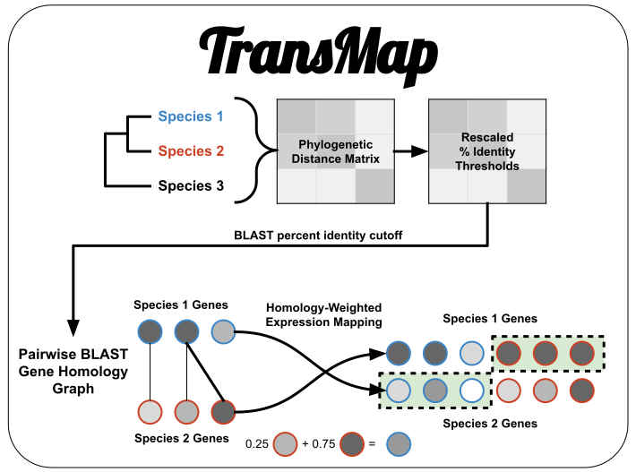

# TransMap
## Rhett M. Rautsaw

***

🚧 This pipeline is under construction 🚧

Feel free to try to use anything in here, but I make no promises that it will work as it is supposed to.

***

TransMap is an analysis pipeline for cross-species comparative transcriptome analyses. Building off the framework of SAMap ([manuscript](https://elifesciences.org/articles/66747); [GitHub](https://github.com/atarashansky/SAMap)), TransMap does this by performing **Homology-Weighted Transcriptome Expression Mapping** to map expression of one species onto another by weighting the expression of similar transcripts via reciprocal BLAST searches.

# Pipeline

# Arguments
| Flag  | Description           | 
|-------|-----------------------|
| -t 	| Folder containing fastas for each species transcriptome named as Genus_species.fasta [default: transcriptomes] |
| -s 	| Species tree for creation of homology graph [default: species_tree.newick] |
| -q 	| Query hsp coverage for BLAST searches [default: 50] |
| -e 	| Folder containing tab-delimited TPM values for individuals of each species named as Genus_species.txt [default: expression] |
| -m 	| Tab-delimited file of metadata for each sample with the first column matching the sample names in the expression files. [default: metadata.txt] |
| -c 	| Number of cpus to speed up some steps. [default: $CPU] |

# Citation

This page and the corresponding publication are under development. I will update this section with the publication once complete. If you use this pipeline prior its publication, please cite this GitHub repository.

